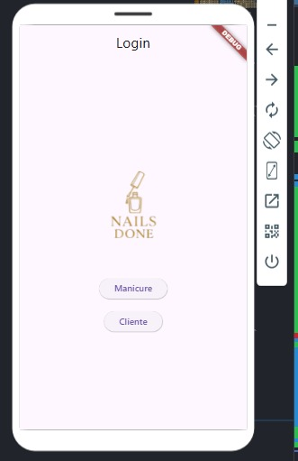
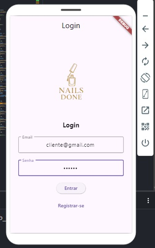
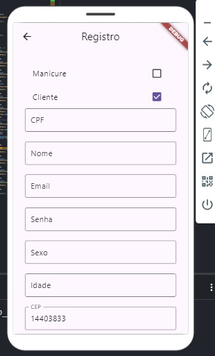
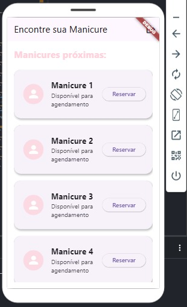
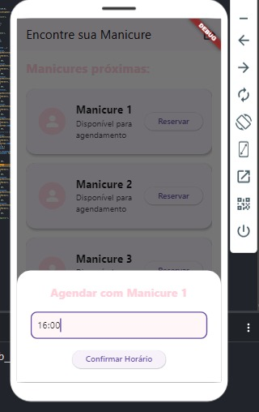
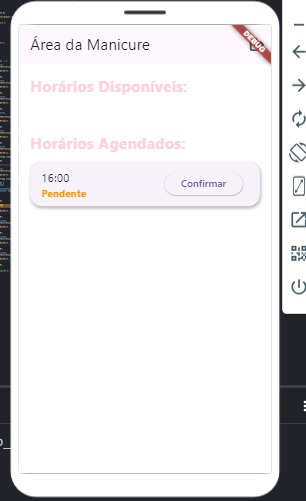
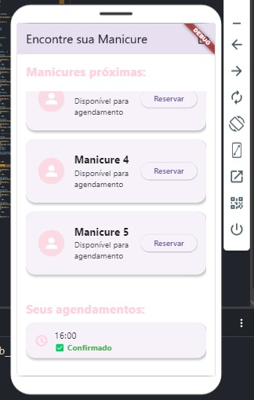

# 📋 Sobre o Sistema

Este sistema é uma aplicação Flutter desenvolvida para gerenciar agendamentos entre clientes e manicures de forma simples e eficiente.

---

## 🖥 Funcionalidades principais

### Tela de Login
Você pode se conectar como **manicure** ou **cliente**.  
*Caso ainda não tenha uma conta, pode se registrar rapidamente.*




### Tela de Registro
Cadastro de nome, e-mail, senha, CPF, sexo, idade e endereço completo.  
O preenchimento do endereço é facilitado com a busca automática de dados pelo CEP, usando integração com a API ViaCEP.



---

## 🔄 Fluxo de Agendamento

- Após o login, o cliente pode visualizar as **manicures disponíveis** e **reservar um horário**.  



- A manicure pode visualizar as **reservas recebidas** e **confirmar ou não** os horários solicitados.  
  

- Quando o horário é confirmado, o **cliente é notificado** que seu agendamento foi aprovado.  


---

## 🚀 Tecnologias utilizadas

- **Flutter** (Desenvolvimento Mobile)
- **Firebase Authentication** (Login e Registro)
- **ViaCEP API** (Busca automática de endereço via CEP)
- **HTTP Package** (Consumo de APIs)

---

## 🎯 Resumo do Fluxo

1. Login ou Registro.
2. Cadastro com busca de endereço automática via CEP.
3. Cliente reserva horário com a manicure.
4. Manicure confirma o horário reservado.
5. Cliente recebe a confirmação.

---

## 📦 Como instalar e rodar o projeto

### Pré-requisitos

- Flutter instalado
- Conta no Firebase
- Projeto criado no Firebase (com configurações inseridas no `main.dart`)
- Dependências adicionadas no `pubspec.yaml`

### Instalação

Clone o repositório:

```bash
git clone https://github.com/seu-usuario/seu-repositorio.git
cd seu-repositorio

Instale as dependências:

bash
flutter pub get

Conecte um dispositivo ou emulador Android/iOS e execute:

bash
flutter run

Configurações importantes
As credenciais do Firebase devem estar corretamente configuradas no arquivo main.dart.

Certifique-se de que o pacote http está no seu pubspec.yaml:

dependencies:
  http: ^1.1.0
📱 Fluxo de uso do app
Acesse a tela de login.
```

## 📱 Fluxo de uso do app

1. **Acesse a tela de login**.
2. **Caso não tenha conta**, clique em **"Registrar-se"**.

### Preencha seu cadastro:

- **Insira o CEP** para preencher automaticamente seu endereço.
- **Escolha** se é **Manicure** ou **Cliente**.

3. **Após o cadastro**:

- **Clientes** conseguem reservar horários.
- **Manicures** confirmam os horários agendados.
- O **sistema** atualiza automaticamente o status de **pendente** para **confirmado**.
